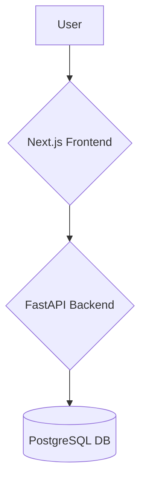
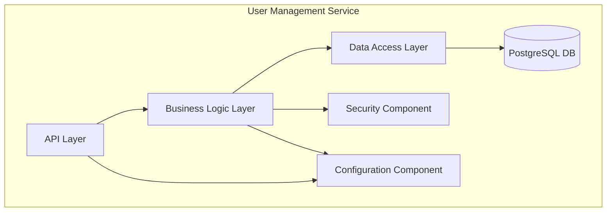
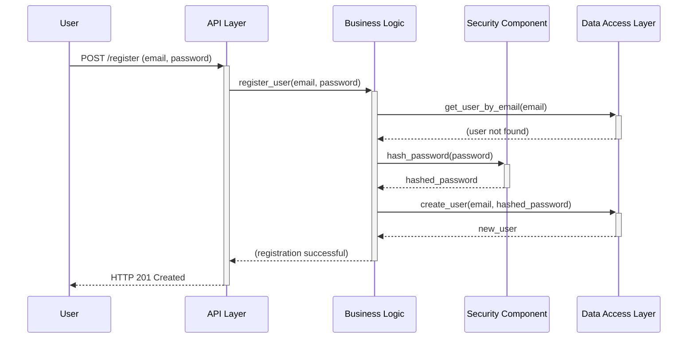
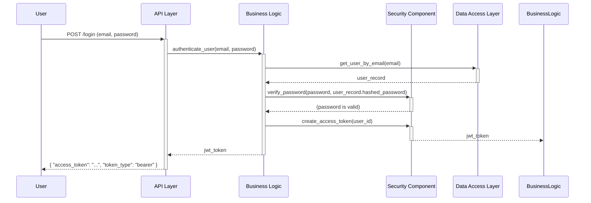

# User Management Backend Architecture Document

## Introduction

This document outlines the overall project architecture for the User Management Backend, including backend systems, shared services, and non-UI specific concerns. Its primary goal is to serve as the guiding architectural blueprint for AI-driven development, ensuring consistency and adherence to chosen patterns and technologies.

**Relationship to Frontend Architecture:**
If the project includes a significant user interface, a separate Frontend Architecture Document will detail the frontend-specific design and MUST be used in conjunction with this document. Core technology stack choices documented herein (see "Tech Stack") are definitive for the entire project, including any frontend components.

### Starter Template or Existing Project

N/A. We will design the architecture from scratch.

### Change Log

| Date | Version | Description | Author |
|---|---|---|---|

---

## High Level Architecture

### Technical Summary

The system will be implemented as a distinct microservice dedicated to user management, following a polyrepo structure for maximum independence. It will be built with Python and the FastAPI framework, leveraging a PostgreSQL database for data persistence and SQLAlchemy as the ORM. The architecture is designed to be containerized with Docker, ensuring consistent deployment environments. It will expose a RESTful API for consumption by client applications, such as a Next.js frontend, using JWT for stateless, secure authentication. This approach directly supports the PRD's goal of creating a reusable, scalable, and secure user management foundation.

### High Level Overview

*   **Architectural Style:** The system will follow a **Microservice** architecture. The user management backend will be a distinct, independently deployable service.
*   **Repository Structure:** A **Polyrepo** structure will be used, with the user management service residing in its own repository to promote independent development, testing, and deployment cycles.
*   **Service Architecture:** The user management backend will operate as a standalone microservice, communicating with other potential services via RESTful APIs.
*   **Primary User Flow:** The conceptual data flow begins with a user interacting with a client application. The client communicates with the FastAPI backend to handle registration, login (issuing a JWT), profile updates, and other user-centric operations, with all user data persisted in the PostgreSQL database.

### High Level Project Diagram



### Architectural and Design Patterns

*   **Microservice Architecture:** The core architectural style, providing service independence and scalability.
    *   *Rationale:* Explicitly required by the PRD to create a distinct, reusable service.
*   **Repository Pattern:** Data access logic will be abstracted from business logic using repositories.
    *   *Rationale:* This decouples the application from the data layer (SQLAlchemy), simplifies testing by allowing mock repositories, and makes future data source changes easier.
*   **Dependency Injection:** FastAPI's built-in DI will be used to manage dependencies like database sessions and service classes.
    *   *Rationale:* This promotes loose coupling, enhances modularity, and improves the testability of components.
*   **RESTful API Communication:** The service will expose its functionality via a RESTful API.
    *   *Rationale:* A standard, stateless, and widely understood pattern for service-to-client and service-to-service communication.

---

## Tech Stack

### Cloud Infrastructure

*   **Provider:** **AWS (Recommended)**, GCP, or Azure
*   **Key Services:**
    *   **Compute:** Amazon ECS (Elastic Container Service) with Fargate for serverless container execution.
    *   **Database:** Amazon RDS for PostgreSQL for a managed database service.
    *   **Container Registry:** Amazon ECR (Elastic Container Registry) to store Docker images.
*   **Deployment Regions:** To be determined based on user location (e.g., `us-east-1`).

### Technology Stack Table

| Category | Technology | Version | Purpose | Rationale |
| :--- | :--- | :--- | :--- | :--- |
| **Language** | Python | 3.11 | Primary backend language | Modern, stable, and widely supported with a rich ecosystem for web development. |
| **Runtime** | Node.js | 20.x LTS | JS runtime for tooling/frontend | Required for many modern frontend frameworks (like the suggested Next.js). |
| **Backend Framework** | FastAPI | ~0.110.0 | Core backend framework | High-performance, easy to learn, and includes automatic API docs. |
| **Web Server** | Uvicorn | ~0.27.0 | ASGI web server | A lightning-fast ASGI server, required for running FastAPI. |
| **ORM** | SQLAlchemy | ~2.0 | Database object-relational mapper | The de-facto standard for Python SQL toolkits, providing robust data mapping. |
| **DB Migration** | Alembic | ~1.13.0 | Database migration tool | Handles database schema changes in a structured, versioned way. Integrates with SQLAlchemy. |
| **Security** | Passlib[bcrypt] | ~1.7.4 | Password hashing | Provides strong, one-way hashing for securely storing user passwords. |
| **Security** | python-jose | ~3.3.0 | JWT handling | For creating, signing, and verifying JSON Web Tokens for authentication. |
| **Configuration** | pydantic-settings | ~2.1.0 | Configuration management | Manages application settings from environment variables and .env files. |
| **Package Manager** | uv | ~0.1.15 | Python package management | An extremely fast and modern package manager for Python. |
| **Database** | PostgreSQL | 16 | Relational database | Powerful, open-source, and reliable object-relational database system. |
| **Infrastructure** | Docker & Docker Compose | latest | Containerization | To create, deploy, and run the application in isolated containers for consistency. |

---

## Data Models

### User Model

*   **Purpose:** Represents a registered user in the system. This model stores authentication credentials and basic profile information. It is the core entity for all user-centric operations.
*   **Key Attributes:**
    *   `id`: `UUID` - The unique identifier for the user (Primary Key).
    *   `email`: `String` - The user's unique email address, used for login and communication.
    *   `username`: `String` - The user's unique username, can also be used for login.
    *   `hashed_password`: `String` - The securely hashed password for the user. This field will never store plaintext passwords.
    *   `full_name`: `String` (Optional) - The user's full name.
    *   `is_active`: `Boolean` - A flag to activate or deactivate the user's account. Defaults to `true`.
    *   `created_at`: `DateTime` - Timestamp indicating when the account was created.
    *   `updated_at`: `DateTime` - Timestamp of the last profile information update.
*   **Relationships:**
    *   Initially, this model will be standalone. Future enhancements could link it to roles, permissions, or extended profile models.

---

## Components

Based on our chosen patterns, the single User Management microservice will be internally structured into several logical components:

### 1. API Layer (Routes)

*   **Responsibility:** This is the service's front door. It defines the RESTful API endpoints (e.g., `/register`, `/login`, `/users/me`), handles incoming HTTP requests, validates request data (using FastAPI's Pydantic integration), and serializes response data.
*   **Key Interfaces:** The OpenAPI specification automatically generated by FastAPI.
*   **Dependencies:** Business Logic Layer.
*   **Technology:** FastAPI.

### 2. Business Logic Layer (Services)

*   **Responsibility:** Contains the core application logic and orchestrates operations. It enforces business rules, such as checking if a user already exists during registration or coordinating the steps for a password change.
*   **Key Interfaces:** Python methods (e.g., `register_new_user(...)`, `authenticate_user(...)`).
*   **Dependencies:** Data Access Layer, Security Component.
*   **Technology:** Plain Python.

### 3. Data Access Layer (Repositories)

*   **Responsibility:** Implements the Repository Pattern to abstract all database interactions. It handles the specifics of creating, reading, updating, and deleting user records from the database.
*   **Key Interfaces:** Repository methods (e.g., `get_user_by_email(...)`, `create_user(...)`).
*   **Dependencies:** SQLAlchemy, PostgreSQL Database.
*   **Technology:** SQLAlchemy.

### 4. Security Component

*   **Responsibility:** A dedicated utility component that centralizes all security-critical operations. This includes hashing and verifying passwords, as well as creating and decoding JWTs.
*   **Key Interfaces:** Helper functions (e.g., `hash_password(...)`, `create_access_token(...)`).
*   **Dependencies:** None.
*   **Technology:** Passlib, python-jose.

### 5. Configuration Component

*   **Responsibility:** Manages all application settings. It loads configuration from environment variables and/or `.env` files, making settings easily accessible throughout the application in a type-safe way.
*   **Key Interfaces:** A single, cached Pydantic `Settings` object.
*   **Dependencies:** None.
*   **Technology:** pydantic-settings.

### Component Interaction Diagram

This diagram shows how a request flows through the internal components of the service.



---

## External APIs

Not applicable for the initial project scope. This section can be expanded later if integrations with third-party services (e.g., for social login or sending emails) are required.

---

## Core Workflows

### 1. User Registration Workflow

This diagram illustrates the process of a new user successfully registering.



### 2. User Login Workflow

This diagram illustrates a registered user successfully logging in and receiving a JWT.



---

## REST API Spec

```yaml
openapi: 3.0.0
info:
  title: User Management Service API
  version: 1.0.0
  description: API for user registration, authentication, and profile management.
servers:
  - url: /api/v1
    description: API Version 1

paths:
  /register:
    post:
      summary: Register a new user
      tags: [Authentication]
      requestBody:
        required: true
        content:
          application/json:
            schema:
              $ref: '#/components/schemas/UserCreate'
      responses:
        '201':
          description: User created successfully
          content:
            application/json:
              schema:
                $ref: '#/components/schemas/UserRead'
        '400':
          description: Bad Request (e.g., user already exists)

  /token:
    post:
      summary: Log in to get an access token
      tags: [Authentication]
      requestBody:
        required: true
        content:
          application/x-www-form-urlencoded:
            schema:
              type: object
              properties:
                username:
                  type: string
                password:
                  type: string
              required: [username, password]
      responses:
        '200':
          description: Successful login
          content:
            application/json:
              schema:
                $ref: '#/components/schemas/Token'
        '401':
          description: Unauthorized

  /users/me:
    get:
      summary: Get current user profile
      tags: [Users]
      security:
        - bearerAuth: []
      responses:
        '200':
          description: Current user data
          content:
            application/json:
              schema:
                $ref: '#/components/schemas/UserRead'
    put:
      summary: Update current user profile
      tags: [Users]
      security:
        - bearerAuth: []
      requestBody:
        required: true
        content:
          application/json:
            schema:
              $ref: '#/components/schemas/UserUpdate'
      responses:
        '200':
          description: User updated successfully
          content:
            application/json:
              schema:
                $ref: '#/components/schemas/UserRead'
    delete:
      summary: Delete current user account
      tags: [Users]
      security:
        - bearerAuth: []
      responses:
        '204':
          description: User account deleted successfully

  /users/me/password:
    put:
      summary: Change current user password
      tags: [Users]
      security:
        - bearerAuth: []
      requestBody:
        required: true
        content:
          application/json:
            schema:
              $ref: '#/components/schemas/PasswordUpdate'
      responses:
        '204':
          description: Password updated successfully

components:
  schemas:
    UserCreate:
      type: object
      properties:
        email:
          type: string
          format: email
        username:
          type: string
        password:
          type: string
      required: [email, username, password]
    UserUpdate:
      type: object
      properties:
        full_name:
          type: string
        email:
          type: string
          format: email
    UserRead:
      type: object
      properties:
        id:
          type: string
          format: uuid
        email:
          type: string
          format: email
        username:
          type: string
        full_name:
          type: string
        is_active:
          type: boolean
    PasswordUpdate:
      type: object
      properties:
        current_password:
          type: string
        new_password:
          type: string
      required: [current_password, new_password]
    Token:
      type: object
      properties:
        access_token:
          type: string
        token_type:
          type: string
          default: bearer

  securitySchemes:
    bearerAuth:
      type: http
      scheme: bearer
      bearerFormat: JWT
```

---

## Database Schema

This SQL script defines the `users` table in our PostgreSQL database.

```sql
-- Enable the uuid-ossp extension to generate UUIDs
CREATE EXTENSION IF NOT EXISTS "uuid-ossp";

-- Create the users table
CREATE TABLE users (
    id UUID PRIMARY KEY DEFAULT uuid_generate_v4(),
    email VARCHAR(255) UNIQUE NOT NULL CHECK (email ~* '^[^@]+@[^@]+\.[^@]+$'),
    username VARCHAR(255) UNIQUE NOT NULL,
    hashed_password VARCHAR(255) NOT NULL,
    full_name VARCHAR(255),
    is_active BOOLEAN NOT NULL DEFAULT TRUE,
    created_at TIMESTAMPTZ NOT NULL DEFAULT NOW(),
    updated_at TIMESTAMPTZ NOT NULL DEFAULT NOW()
);

-- Add indexes for faster lookups on email and username
CREATE INDEX idx_users_email ON users(email);
CREATE INDEX idx_users_username ON users(username);

-- Create a trigger function to automatically update the updated_at timestamp
CREATE OR REPLACE FUNCTION update_updated_at_column()
RETURNS TRIGGER AS $$
BEGIN
    NEW.updated_at = NOW();
    RETURN NEW;
END;
$$ LANGUAGE plpgsql;

-- Attach the trigger to the users table
CREATE TRIGGER update_users_updated_at
BEFORE UPDATE ON users
FOR EACH ROW
EXECUTE FUNCTION update_updated_at_column();
```

---

## Source Tree

This is the proposed directory structure for the User Management service:

```plaintext
user-management-service/
├── alembic/                    # Alembic migration scripts
│   ├── versions/               # Individual migration files
│   └── env.py                  # Alembic configuration
├── app/                        # Main application source code
│   ├── __init__.py
│   ├── api/                    # API layer with versioned routers
│   │   ├── __init__.py
│   │   └── v1/
│   │       ├── __init__.py
│   │       └── endpoints/
│   │           ├── auth.py
│   │           └── users.py
│   ├── core/                   # Core logic: config, security
│   │   ├── __init__.py
│   │   ├── config.py           # Pydantic settings
│   │   └── security.py         # JWT and password logic
│   ├── crud/                   # Data Access Layer (CRUD functions)
│   │   ├── __init__.py
│   │   └── crud_user.py
│   ├── db/                     # Database session management
│   │   ├── __init__.py
│   │   └── session.py
│   ├── models/                 # SQLAlchemy ORM models
│   │   ├── __init__.py
│   │   └── user.py
│   ├── schemas/                # Pydantic API schemas
│   │   ├── __init__.py
│   │   └── user.py
│   └── services/               # Business Logic Layer
│       ├── __init__.py
│       └── user_service.py
├── tests/                      # Application tests
│   ├── __init__.py
│   └── conftest.py             # Pytest fixtures and test setup
├── .env.example                # Example environment variables
├── .gitignore
├── main.py                     # Application entry point (Uvicorn starts here)
└── pyproject.toml              # Project dependencies and metadata (for uv)
```

---

## Infrastructure and Deployment

### Infrastructure as Code (IaC)

*   **Tool:** **Terraform (~1.7)** will be used for provisioning and managing cloud infrastructure.
    *   *Rationale:* Terraform is a cloud-agnostic, widely-adopted standard that allows us to define our infrastructure declaratively, ensuring it is versioned and repeatable.
*   **Location:** IaC code will reside in an `infrastructure/` directory at the root of the service's repository.
*   **Approach:** Terraform will be used to define all necessary AWS resources, including the ECS cluster, Fargate task definitions, RDS for PostgreSQL instance, networking (VPC, subnets), and security groups.

### Deployment Strategy

*   **Strategy:** **Blue/Green Deployment**. When a new version is deployed, a new "green" environment is created alongside the existing "blue" environment. Traffic is only switched to the green environment after it passes health checks. The old blue environment is kept on standby for a short period to allow for instant rollbacks.
    *   *Rationale:* This strategy provides zero-downtime deployments and minimizes risk.
*   **CI/CD Platform:** **GitHub Actions**.
    *   *Rationale:* It integrates seamlessly with GitHub repositories and provides a robust, configurable platform for building, testing, and deploying our containerized application.
*   **Pipeline Configuration:** The CI/CD pipeline will be defined in `.github/workflows/deploy.yml`.

### Environments

*   **Development:** Local developer environment managed via `docker-compose`. This allows for rapid testing and iteration.
*   **Staging:** A production-like environment hosted on AWS. Deployed automatically on merges to the `develop` branch. Used for integration testing and QA.
*   **Production:** The live environment serving end-users. Deployed automatically on merges to the `main` branch after successful staging deployment.

### Environment Promotion Flow

The promotion of code from development to production will follow a standard GitFlow-like model:

`Feature Branch -> Pull Request -> `develop` Branch (Deploys to Staging) -> Pull Request -> `main` Branch (Deploys to Production)`

### Rollback Strategy

*   **Primary Method:** With a Blue/Green strategy, a rollback is achieved by simply redirecting traffic back to the previous, stable "blue" environment. This is a near-instantaneous operation.
*   **Trigger Conditions:** Rollbacks can be triggered automatically by a high rate of application errors (>1% 5xx errors) detected by monitoring tools post-deployment, or manually if an issue is discovered.
*   **Recovery Time Objective (RTO):** < 5 minutes.

---

## Error Handling Strategy

### General Approach

*   **Error Model:** We will use a system of custom Python exceptions. A base `AppException` will be created, and more specific exceptions (e.g., `UserNotFoundException`, `DuplicateUserException`) will inherit from it.
*   **Exception Hierarchy:** This allows us to catch specific error types and handle them appropriately.
*   **Error Propagation:** Exceptions raised in the business logic or data access layers will be caught by global FastAPI exception handlers. These handlers will be responsible for logging the error and returning a standardized, user-friendly JSON error response with the correct HTTP status code.

### Logging Standards

*   **Library:** Python's built-in `logging` module.
*   **Format:** **JSON**. Structured logs are machine-readable, making them easy to search, filter, and analyze in modern logging platforms (like AWS CloudWatch Logs or the ELK stack).
*   **Levels:** Standard Python log levels will be used (`DEBUG`, `INFO`, `WARNING`, `ERROR`, `CRITICAL`).
*   **Required Context:**
    *   **Correlation ID:** A unique ID will be generated for each incoming request (or read from an `X-Request-ID` header) and included in every log message produced while handling that request. This allows us to trace a single user's action throughout the entire system.

### Error Handling Patterns

*   **External API Errors:**
    *   *(Not applicable for MVP)*. When external APIs are added, we will implement standard patterns like **Retry policies** for transient failures and **Circuit Breakers** for prolonged outages.
*   **Business Logic Errors:**
    *   **Custom Exceptions:** Specific exceptions like `UserNotFoundException` will be raised from the business logic to clearly signal the error condition.
    *   **User-Facing Errors:** The API exception handlers will convert these exceptions into clean JSON responses (e.g., `{"detail": "A user with this email already exists"}`) with an appropriate HTTP status code (e.g., 400 Bad Request).
*   **Data Consistency:**
    *   **Transaction Strategy:** We will leverage SQLAlchemy's session management. For any business logic that involves multiple database writes, all operations will be performed within a single transaction block (`try...except...finally` with a `session.commit()` or `session.rollback()`) to ensure data integrity.

---

## Coding Standards

### Core Standards

*   **Languages & Runtimes:** All Python code must be compatible with **Python 3.11**.
*   **Style & Linting:** We will use **Ruff** for all linting and code formatting. It is an extremely fast, all-in-one tool that replaces Black, isort, and Flake8. Configuration will be stored in `pyproject.toml` to enforce a single, consistent style.
*   **Test Organization:** All tests must be placed in the `/tests` directory. Test files must be named `test_*.py`. The **Arrange-Act-Assert** pattern must be used within tests.

### Naming Conventions

We will adhere strictly to the standard **PEP 8** style guide for all Python code. No project-specific deviations are defined.

### Critical Rules for AI Agents

These rules are non-negotiable and must be followed in all generated code:

1.  **Use the Service Layer:** All business logic MUST be implemented in files within the `app/services/` directory. The API layer (`app/api/`) is strictly for handling HTTP requests/responses and calling the service layer.
2.  **Use the CRUD/Repository Layer:** All database interactions MUST go through functions defined in the `app/crud/` directory. Do NOT use SQLAlchemy models or sessions directly in the API or service layers.
3.  **Use Dependency Injection:** All dependencies (e.g., database sessions, service classes) MUST be acquired using FastAPI's `Depends` system in the API layer. Do not create instances of services or sessions manually within endpoint functions.
4.  **No Secrets in Code:** NEVER hardcode secrets (passwords, API keys, etc.). All configuration MUST be loaded from the environment via the Pydantic `Settings` object in `app/core/config.py`.
5.  **Raise Specific Exceptions:** For all business logic errors (e.g., user not found, email already exists), raise a specific custom exception from the service layer. Do not return `None` or raise generic `Exception`s.

### Language-Specific Guidelines

No additional language-specific guidelines are needed. The combination of Ruff and the critical rules above is sufficient.

---

## Test Strategy and Standards

### Testing Philosophy

*   **Approach:** We will follow a **Test-Driven Development (TDD)** approach. This involves writing a failing test before writing any production code, then writing just enough code to make the test pass, and finally refactoring the code while ensuring all tests remain green. All new code must adhere to the TDD cycle (Red-Green-Refactor).
*   **Coverage Goals:** We will aim for **>90%** code coverage on critical business logic (`services`) and data access (`crud`) layers, with an overall project coverage target of **>85%**.
*   **Test Pyramid:** We will maintain a balanced test pyramid: a wide base of fast **Unit Tests**, a smaller layer of **Integration Tests**, and a minimal set of **End-to-End (E2E) Tests** (post-MVP).

### Test Types and Organization

*   **Unit Tests**
    *   **Framework:** **Pytest**
    *   **Location & Convention:** `tests/unit/test_*.py`
    *   **Mocking Library:** Python's built-in `unittest.mock`.
    *   **AI Agent Requirements:**
        *   Generate tests for all public methods and functions.
        *   Mock all external dependencies (e.g., mock the data access layer when testing the service layer).
        *   Follow the Arrange-Act-Assert pattern.

*   **Integration Tests**
    *   **Scope:** To test the service from the API boundary down to a real database, ensuring all layers work together correctly.
    *   **Location:** `tests/integration/`
    *   **Test Infrastructure:**
        *   **Database:** We will use **Testcontainers** to programmatically spin up a real PostgreSQL Docker container for the test suite. This ensures our tests run against an environment that is identical to production.

*   **End-to-End (E2E) Tests**
    *   **Framework:** *(Post-MVP)* **Pytest with Playwright**.
    *   **Scope:** *(Post-MVP)* To test critical user journeys (like registration and login) by automating a real browser against a deployed `Staging` environment.

### Test Data Management

*   **Strategy:** We will use the **Factory pattern** (with a library like `factory-boy`) to create consistent, reusable test data.
*   **Fixtures:** Reusable test setup, such as database connections or authenticated user clients, will be managed using **Pytest fixtures** in `conftest.py`.
*   **Cleanup:** Each test will run inside an isolated database transaction that is automatically rolled back after the test completes, ensuring a clean state for every test and preventing side effects.

### Continuous Testing

*   **CI Integration:** The GitHub Actions CI pipeline will run the full suite of unit and integration tests on every pull request. Merging will be blocked if tests fail or if coverage drops below the target.
*   **Security Tests:** We will integrate the `Bandit` static analysis security tool into the CI pipeline to automatically scan for common security vulnerabilities in the Python code.

---

## Security

### Input Validation

*   **Validation Library:** **Pydantic**. It is integrated directly into FastAPI.
*   **Validation Location:** Strictly at the **API Boundary**. All data from an incoming request is validated by a Pydantic schema before it ever reaches the business logic.
*   **Required Rules:** We will use a whitelist approach; any unknown fields in a request body will be rejected.

### Authentication & Authorization

*   **Auth Method:** **JWT (JSON Web Tokens)** sent via the `Authorization: Bearer <token>` header.
*   **Session Management:** The system is **100% stateless**. No server-side sessions will be used.
*   **Required Patterns:** A reusable FastAPI dependency will be created to validate the JWT on protected endpoints and retrieve the current user. This dependency will be required for any endpoint that accesses or modifies user-specific data.

### Secrets Management

*   **Development:** Secrets (e.g., database passwords) will be stored in a local `.env` file, which **MUST** be included in `.gitignore`.
*   **Production:** Secrets will be injected as **environment variables** by the hosting environment (e.g., AWS Secrets Manager feeding into the ECS task definition).
*   **Code Requirements:** Secrets must NEVER be hardcoded. They must only be accessed via the central Pydantic `Settings` object.

### API Security

*   **Rate Limiting:** *(Post-MVP)* A middleware will be added to limit the number of requests per user to prevent abuse.
*   **CORS Policy:** A CORS (Cross-Origin Resource Sharing) middleware will be configured to only allow requests from the specific, approved frontend application's domain.
*   **HTTPS Enforcement:** The production load balancer will enforce HTTPS on all connections.

### Data Protection

*   **Encryption at Rest:** The production database (AWS RDS) will have encryption at rest enabled.
*   **Encryption in Transit:** All network traffic will be encrypted using TLS (HTTPS).
*   **PII Handling:** The only sensitive PII is the user's password, which MUST only be stored after being strongly hashed with `bcrypt`.
*   **Logging Restrictions:** Under no circumstances should plaintext passwords, API keys, or JWTs be logged.

### Dependency Security

*   **Scanning Tool:** We will use **GitHub's Dependabot** to automatically scan for known vulnerabilities in our third-party packages.
*   **Update Policy:** Dependabot will be configured to automatically create pull requests to update vulnerable dependencies.

### Security Testing

*   **SAST Tool:** The `Bandit` static analysis tool will be integrated into the CI/CD pipeline to run on every pull request, scanning for common Python security issues.

---

## Checklist Results Report

*(This section will be populated after running the architect-checklist).*

---

## Next Steps

*(This section will be populated after the architecture is finalized).*