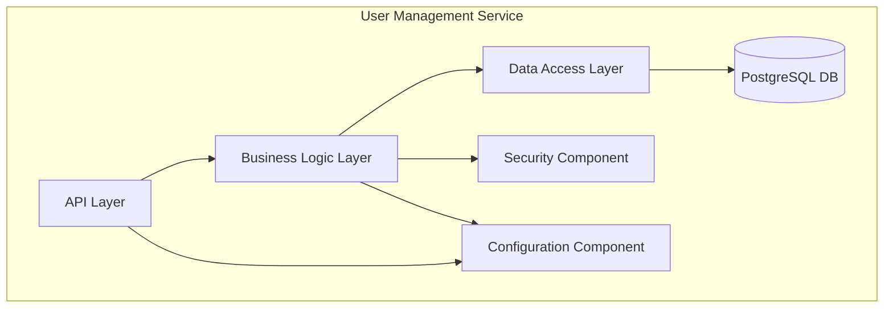

# Components

Based on our chosen patterns, the single User Management microservice will be internally structured into several logical components:

## 1. API Layer (Routes)

*   **Responsibility:** This is the service's front door. It defines the RESTful API endpoints (e.g., `/register`, `/login`, `/users/me`), handles incoming HTTP requests, validates request data (using FastAPI's Pydantic integration), and serializes response data.
*   **Key Interfaces:** The OpenAPI specification automatically generated by FastAPI.
*   **Dependencies:** Business Logic Layer.
*   **Technology:** FastAPI.

## 2. Business Logic Layer (Services)

*   **Responsibility:** Contains the core application logic and orchestrates operations. It enforces business rules, such as checking if a user already exists during registration or coordinating the steps for a password change.
*   **Key Interfaces:** Python methods (e.g., `register_new_user(...)`, `authenticate_user(...)`).
*   **Dependencies:** Data Access Layer, Security Component.
*   **Technology:** Plain Python.

## 3. Data Access Layer (Repositories)

*   **Responsibility:** Implements the Repository Pattern to abstract all database interactions. It handles the specifics of creating, reading, updating, and deleting user records from the database.
*   **Key Interfaces:** Repository methods (e.g., `get_user_by_email(...)`, `create_user(...)`).
*   **Dependencies:** SQLAlchemy, PostgreSQL Database.
*   **Technology:** SQLAlchemy.

## 4. Security Component

*   **Responsibility:** A dedicated utility component that centralizes all security-critical operations. This includes hashing and verifying passwords, as well as creating and decoding JWTs.
*   **Key Interfaces:** Helper functions (e.g., `hash_password(...)`, `create_access_token(...)`).
*   **Dependencies:** None.
*   **Technology:** Passlib, python-jose.

## 5. Configuration Component

*   **Responsibility:** Manages all application settings. It loads configuration from environment variables and/or `.env` files, making settings easily accessible throughout the application in a type-safe way.
*   **Key Interfaces:** A single, cached Pydantic `Settings` object.
*   **Dependencies:** None.
*   **Technology:** pydantic-settings.

## Component Interaction Diagram

This diagram shows how a request flows through the internal components of the service.

---
