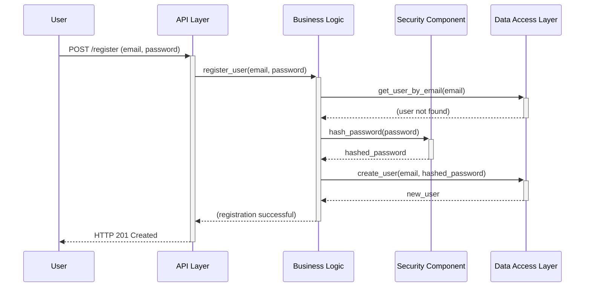
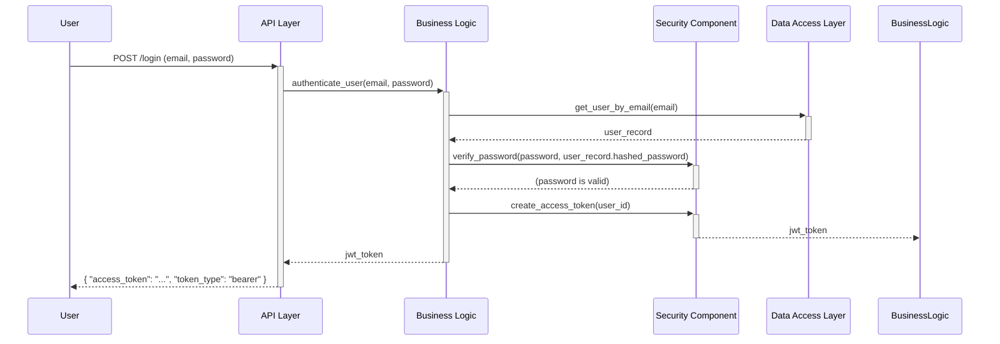

# Core Workflows

## 1. User Registration Workflow

This diagram illustrates the process of a new user successfully registering.

## 2. User Login Workflow

This diagram illustrates a registered user successfully logging in and receiving a JWT.

---
