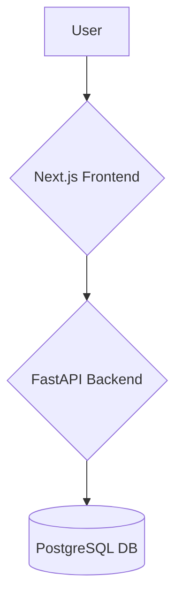

# High Level Architecture

## Technical Summary

The system will be implemented as a distinct microservice dedicated to user management, following a polyrepo structure for maximum independence. It will be built with Python and the FastAPI framework, leveraging a PostgreSQL database for data persistence and SQLAlchemy as the ORM. The architecture is designed to be containerized with Docker, ensuring consistent deployment environments. It will expose a RESTful API for consumption by client applications, such as a Next.js frontend, using JWT for stateless, secure authentication. This approach directly supports the PRD's goal of creating a reusable, scalable, and secure user management foundation.

## High Level Overview

*   **Architectural Style:** The system will follow a **Microservice** architecture. The user management backend will be a distinct, independently deployable service.
*   **Repository Structure:** A **Polyrepo** structure will be used, with the user management service residing in its own repository to promote independent development, testing, and deployment cycles.
*   **Service Architecture:** The user management backend will operate as a standalone microservice, communicating with other potential services via RESTful APIs.
*   **Primary User Flow:** The conceptual data flow begins with a user interacting with a client application. The client communicates with the FastAPI backend to handle registration, login (issuing a JWT), profile updates, and other user-centric operations, with all user data persisted in the PostgreSQL database.

## High Level Project Diagram

## Architectural and Design Patterns

*   **Microservice Architecture:** The core architectural style, providing service independence and scalability.
    *   *Rationale:* Explicitly required by the PRD to create a distinct, reusable service.
*   **Repository Pattern:** Data access logic will be abstracted from business logic using repositories.
    *   *Rationale:* This decouples the application from the data layer (SQLAlchemy), simplifies testing by allowing mock repositories, and makes future data source changes easier.
*   **Dependency Injection:** FastAPI's built-in DI will be used to manage dependencies like database sessions and service classes.
    *   *Rationale:* This promotes loose coupling, enhances modularity, and improves the testability of components.
*   **RESTful API Communication:** The service will expose its functionality via a RESTful API.
    *   *Rationale:* A standard, stateless, and widely understood pattern for service-to-client and service-to-service communication.

---
