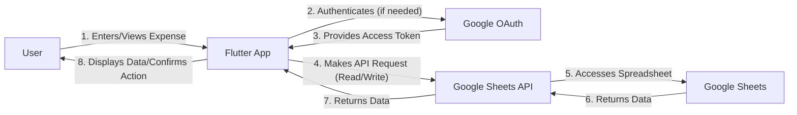

# Architecture Document for BMad-FamilyExpenseTracker

## 1. Overall System Architecture

The `BMad-FamilyExpenseTracker` application employs a client-server architecture, where the Flutter mobile application acts as the client, and Google Sheets serves as the primary data store (backend) via the Google Sheets API. User authentication is handled securely through Google OAuth.

**Key Components:**
*   **Flutter Client Application:** A cross-platform mobile application developed with Flutter, responsible for the user interface, state management, and interaction with the Google Sheets API.
*   **Google Sheets API:** The intermediary layer that allows the Flutter application to read, write, and manage data within Google Sheets.
*   **Google Sheets:** The collaborative spreadsheet service used for storing all expense categories and monthly expense records. Each month's data resides in a dedicated tab (e.g., `YYYY-MM`), and categories are in a `Category` tab.
*   **Google OAuth:** Provides secure user authentication and authorization, ensuring the application can only access Google Sheets with the user's explicit permission.

```mermaid
graph TD
    A[Family Expense Tracker App (Flutter)] -->|1. User Interaction| B(Google OAuth)
    B -->|2. Authenticates User| C(Google Identity Platform)
    C -->|3. Returns Access Token| B
    B -->|4. Uses Access Token for API Calls| D(Google Sheets API)
    D -->|5. Reads/Writes Data| E(Google Sheets)
    E -->|6. Returns Data| D
    D -->|7. Returns Data to App| A
```

## 2. Data Flow Diagram

The data flow illustrates how information moves between the user, the Flutter application, the Google Sheets API, and Google Sheets.



**Detailed Data Flow:**
1.  **User Interaction:** A family member interacts with the Flutter app to view, add, edit, or delete expense records or categories.
2.  **Authentication:** If not already authenticated, the app initiates the Google OAuth flow.
3.  **Authorization:** The user grants the app permission to access their Google Sheets. Google OAuth provides an access token to the Flutter app.
4.  **API Request:** The Flutter app uses the obtained access token to make authenticated requests to the Google Sheets API (e.g., `spreadsheets.values.get`, `spreadsheets.values.append`, `spreadsheets.values.update`, `spreadsheets.values.clear`).
5.  **Google Sheets Access:** The Google Sheets API processes the request, interacting directly with the specified Google Sheet document and its tabs.
6.  **Data Retrieval/Modification:** Data is read from or written to the relevant `YYYY-MM` or `Category` tab within Google Sheets.
7.  **API Response:** The Google Sheets API returns the requested data or a confirmation of the operation to the Flutter app.
8.  **App Update:** The Flutter app updates its UI to reflect the latest data or confirms the user's action.

## 3. Component Breakdown (Flutter Application)

The Flutter application is structured into several logical layers to ensure modularity, maintainability, and testability.

*   **UI Layer (Presentation):**
    *   **Widgets & Screens:** Composed of stateless and stateful widgets that form the user interface. This includes screens for expense lists, expense entry/editing, month navigation, and category display.
    *   **Material 3 Design:** Adheres to Material 3 guidelines for a modern and consistent look and feel across platforms.
    *   **Interaction Logic:** Handles user input and dispatches events/actions to the State Management Layer.

*   **State Management Layer (Application Logic):**
    *   **Riverpod/Provider:** Utilized for managing the application's state, including:
        *   Loading states (e.g., `isLoading`, `isError`).
        *   Data fetched from Google Sheets (e.g., `List<ExpenseRecord>`, `List<Category>`).
        *   UI-specific states (e.g., selected month, filter criteria).
    *   **Providers:** Define how different parts of the application can access and react to changes in state.

*   **Data Layer (Repository Pattern):**
    *   **`AuthRepository`:** An abstract interface defining authentication operations (e.g., `signInWithGoogle`, `signOut`, `getCurrentUser`). Its concrete implementation handles Google OAuth.
    *   **`ExpenseRepository`:** An abstract interface defining CRUD operations for expense records (e.g., `getExpensesForMonth`, `addExpense`, `updateExpense`, `deleteExpense`).
    *   **`CategoryRepository`:** An abstract interface defining operations for categories (e.g., `getCategories`).
    *   **Implementations:** Concrete implementations (e.g., `GoogleSheetsExpenseRepository`, `GoogleSheetsCategoryRepository`) interact with the `GoogleSheetsService` to perform actual API calls. This abstraction allows for easy swapping of the backend in the future.

*   **Service Layer:**
    *   **`GoogleSheetsService`:** A low-level service responsible for direct interaction with the Google Sheets API. It handles:
        *   Making HTTP requests to the Google Sheets API.
        *   Parsing API responses into raw data structures.
        *   Handling API-specific errors and rate limits.
        *   Creating new `YYYY-MM` tabs as needed.
    *   **`DataMapper`:** (Implicit within repositories/services) Responsible for mapping raw data from Google Sheets (rows/columns) to Flutter data models (`ExpenseRecord`, `Category`) and vice-versa.

*   **Models Layer:**
    *   **`ExpenseRecord`:** Data class representing a single expense, including fields like `RecordID` (UUID), `Date`, `Name`, `Category`, `Amount`, `RecordedBy`, `CreatedAt`, `LastModified`, `Notes`.
    *   **`Category`:** Data class representing an expense category, including `CategoryID` (UUID), `CategoryName`, `ColorCode`, `IsActive`.

## 4. Technology Choices Justification

*   **Flutter:**
    *   **Cross-Platform Development:** Enables building native iOS and Android applications from a single codebase, significantly reducing development time and cost.
    *   **Fast Development:** Hot Reload and a rich set of pre-built widgets accelerate UI development.
    *   **Native Performance:** Compiles to native code, offering excellent performance and smooth user experiences.
    *   **Rich UI Capabilities:** Flexible and expressive UI framework, allowing for custom and beautiful designs adhering to Material 3.

*   **Google Sheets API:**
    *   **Accessible Backend:** Leverages a familiar and widely used tool (Google Sheets) as a "no-code" backend, making it easy for non-technical users to manage data directly.
    *   **Collaboration:** Inherits Google Sheets' collaborative features, allowing multiple family members to view and edit data directly in the spreadsheet.
    *   **Cost-Effective (Initial):** Eliminates the need for a dedicated server and database in the initial phase, reducing infrastructure costs.

*   **Riverpod/Provider (State Management):**
    *   **Robustness & Testability:** Riverpod (preferred for new projects) offers compile-time safety, easy testing, and a clear dependency graph, leading to more robust and maintainable code. Provider is a solid alternative.
    *   **Scalability:** Provides a structured way to manage application state, making it easier to scale the application as complexity grows.
    *   **Developer Experience:** Simplifies state management logic, reducing boilerplate and improving developer productivity.

## 5. Security Considerations

Security is paramount, especially when dealing with personal financial data and Google API access.

*   **Secure Google OAuth Handling:**
    *   **OAuth 2.0 for Mobile Apps:** Implement the recommended OAuth 2.0 flow for mobile and desktop applications, typically using the `google_sign_in` package, which handles the secure redirection and token exchange.
    *   **Token Storage:** Access tokens and refresh tokens must be stored securely on the device (e.g., using `flutter_secure_storage` or platform-specific secure storage mechanisms like KeyChain on iOS and EncryptedSharedPreferences on Android).
    *   **Least Privilege:** The application will request only the necessary Google Sheets scopes (e.g., `https://www.googleapis.com/auth/spreadsheets` for read/write access to spreadsheets it creates or is given access to), minimizing potential damage if tokens are compromised.
    *   **Token Refresh:** Implement proper refresh token mechanisms to obtain new access tokens without requiring the user to re-authenticate frequently.

*   **Encrypted Data Transmission (HTTPS):**
    *   All communication between the Flutter app and the Google Sheets API occurs over HTTPS, ensuring that data is encrypted in transit and protected from eavesdropping and tampering. This is handled automatically by the `googleapis` and `http` packages.

*   **Input Validation:**
    *   All user inputs (e.g., expense amounts, category names) will be validated on the client-side to prevent invalid data from being sent to Google Sheets and to mitigate potential injection attacks (though less critical with Sheets API than a traditional database).

*   **Data Integrity:**
    *   The introduction of `RecordID` (UUID) and `CategoryID` as hidden columns in Google Sheets is crucial for maintaining data integrity during update and delete operations, preventing accidental modification or deletion of incorrect records.

## 6. Scalability and Future-Proofing

The architecture is designed with future growth and potential backend transitions in mind.

*   **Repository Pattern for Backend Agnosticism:**
    *   The Data Layer's use of abstract `ExpenseRepository` and `CategoryRepository` interfaces is a key enabler for future-proofing. If the need arises to switch from Google Sheets to a custom backend (e.g., Python FastAPI + PostgreSQL), only the concrete implementations of these repositories (e.g., `FastAPIBasedExpenseRepository`) would need to be rewritten, leaving the UI and State Management layers largely untouched.

*   **Modular Architecture:**
    *   The clear separation of concerns into UI, State Management, Data, and Service layers ensures that changes in one area have minimal impact on others, facilitating easier maintenance and extension.

*   **Unique Identifiers (`RecordID`, `CategoryID`):**
    *   By generating and storing unique UUIDs for each expense record and category, the application establishes stable identifiers that are independent of Google Sheets' row numbers. This is critical for a seamless migration to a relational database where primary keys are fundamental.

*   **Planned Offline Caching (Future Enhancement):**
    *   The roadmap includes implementing a local database (e.g., Hive, Sqflite, Isar) for offline caching. This will significantly improve performance, user experience in low-connectivity environments, and reduce reliance on constant Google Sheets API calls, thereby enhancing scalability. This local data layer would sit between the UI/State Management and the Google Sheets API, acting as a primary source of truth for the app.

*   **API Rate Limit Awareness:**
    *   The design acknowledges Google Sheets API rate limits. Strategies like caching frequently accessed data (e.g., categories) and batching write operations will be considered to optimize API usage and prevent hitting limits.

## 7. Error Handling Strategy

A robust error handling strategy is essential for a reliable and user-friendly application.

*   **Centralized Error Handling:**
    *   Errors originating from the `GoogleSheetsService` (e.g., network issues, API errors, authentication failures) will be caught at the Data Layer (Repository implementations).
    *   These errors will then be propagated up through the State Management Layer (e.g., by updating an `error` state in a Riverpod/Provider provider).

*   **User-Friendly Error Messages:**
    *   Technical error messages from the API will be translated into clear, concise, and actionable messages for the end-user (e.g., "Network connection lost. Please check your internet.", "Failed to load expenses. Please try again.").
    *   Toast messages, snackbars, or dedicated error screens will be used to display these messages.

*   **Retry Mechanisms:**
    *   For transient errors (e.g., network timeouts, temporary API unavailability), the application will implement retry logic with exponential backoff to automatically re-attempt failed operations.
    *   Users will also be given the option to manually retry operations.

*   **Logging:**
    *   Detailed error information (stack traces, API response codes) will be logged internally (e.g., using a logging package like `logger`) for debugging and monitoring purposes, without exposing sensitive information to the user.

*   **Graceful Degradation:**
    *   In cases of severe errors (e.g., inability to authenticate or access Google Sheets), the application will degrade gracefully, perhaps by showing a limited view or guiding the user to resolve the issue.

*   **Validation Errors:**
    *   Input validation errors will be handled at the UI layer, providing immediate feedback to the user before attempting to send invalid data to the backend.
